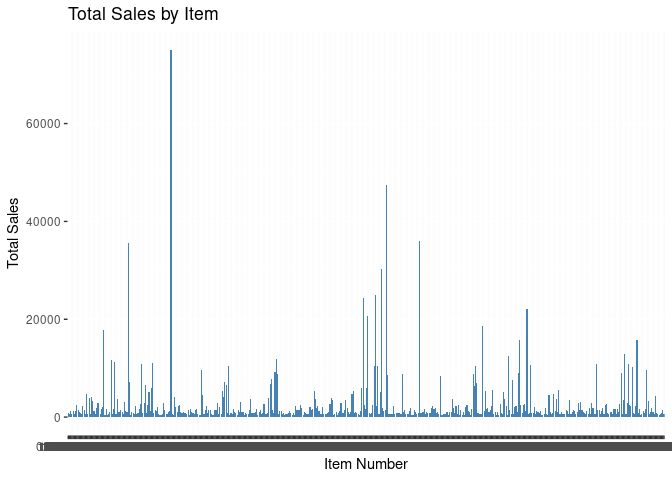

Activity 8 - Mini-competition
================

## Loading the libraries

``` r
library(ggplot2)
library(rpart)
library(rpart.plot)
library(tidyr)
library(dplyr)
```

    ## 
    ## Attaching package: 'dplyr'

    ## The following objects are masked from 'package:stats':
    ## 
    ##     filter, lag

    ## The following objects are masked from 'package:base':
    ## 
    ##     intersect, setdiff, setequal, union

## Reading the data

``` r
data <- read.csv("inventory.csv")

# check the structure of the data
str(data)
```

    ## 'data.frame':    26352 obs. of  3 variables:
    ##  $ item_no: chr  "020-307" "020-307" "020-307" "020-307" ...
    ##  $ week   : int  0 1 2 3 4 5 6 7 8 9 ...
    ##  $ sold   : int  0 80 0 0 0 0 0 0 80 0 ...

``` r
# check summary statistics
summary(data)
```

    ##    item_no               week           sold        
    ##  Length:26352       Min.   : 0.0   Min.   :   0.00  
    ##  Class :character   1st Qu.:13.0   1st Qu.:   0.00  
    ##  Mode  :character   Median :26.5   Median :   0.00  
    ##                     Mean   :26.5   Mean   :  50.62  
    ##                     3rd Qu.:40.0   3rd Qu.:   2.00  
    ##                     Max.   :53.0   Max.   :7200.00

## Looking at the missing values

``` r
sum(is.na("inventory.csv"))
```

    ## [1] 0

There are no missing values in the data.

## EDA

``` r
## Looking at the unique products in the data

unique_items <- unique(data$item_no)
length(unique_items)
```

    ## [1] 488

``` r
# Get a data frame of unique items and their total sales
unique_sales <- aggregate(sold ~ item_no, data = data, FUN = sum)

# Order the data frame by total sales and get the top 50 items
top_50_items <- unique_sales[order(unique_sales$sold, decreasing = TRUE), ][1:50, ]

# Print the resulting data frame
print(top_50_items)
```

    ##              item_no  sold
    ## 85           A510004 75047
    ## 261   MX40-STD-24242 47498
    ## 288 P-020X02015SW100 36000
    ## 50            200830 35500
    ## 257   MX40-STD-20252 30289
    ## 252   MX40-STD-20202 24960
    ## 242   MX40-STD-16202 24291
    ## 376     POG5RP1P-AJR 22050
    ## 246   MX40-STD-16252 20615
    ## 340  PES25P2F-WE-AJR 18604
    ## 30      10155.022020 17836
    ## 370    POG3P2SSH-AJR 15850
    ## 466     XP-STD-24242 15708
    ## 456     XP-STD-16252 12948
    ## 361  POG10P2F-WE-AJR 12410
    ## 171   DP40-STD-24242 11849
    ## 36          153-2424 11733
    ## 39          154-2424 11203
    ## 70             41250 11000
    ## 61         255002424 10937
    ## 459     XP-STD-20202 10905
    ## 433   VL-EC-PD-82515 10800
    ## 379   PP-020-020-030 10573
    ## 334     PES1P2SH-AJR 10530
    ## 132     BPONG50P2PWE 10500
    ## 254   MX40-STD-20242 10438
    ## 251   MX40-STD-20201 10400
    ## 462     XP-STD-20252 10260
    ## 474    XPH-STD-24242  9654
    ## 110     BF000230-167  9648
    ## 170   DP40-STD-20252  9122
    ## 453     XP-STD-16202  9044
    ## 369    POG25RP2P-AJR  9000
    ## 172   DP40-STD-24244  8904
    ## 274 NMO200P4SH-A-AJR  8800
    ## 332    PES10P3SH-AJR  8800
    ## 262   MX40-STD-24244  8694
    ## 305    PA-3 20X20-NA  8385
    ## 167   DP40-STD-20202  7810
    ## 364    POG15RP2P-AJR  7500
    ## 51            200833  7200
    ## 129      BPONG1P2PWE  7150
    ## 335    PES1P2SSH-AJR  7000
    ## 166   DP40-STD-16252  6749
    ## 64         299242401  6504
    ## 130     BPONG25P2PWE  6500
    ## 333  PES1P2SH-30-AJR  6300
    ## 69             41169  6000
    ## 241   MX40-STD-16201  5925
    ## 245   MX40-STD-16251  5899

Item “A510004” has the highest number of sales i.e 75047

``` r
# Create a new data frame with the count of weeks for each item which have 0 sales
zero_sales <- data %>%
  group_by(item_no) %>%
  summarize(count = sum(sold == 0)) 
zero_sales
```

    ## # A tibble: 488 × 2
    ##    item_no      count
    ##    <chr>        <int>
    ##  1 020-307         44
    ##  2 020-502         43
    ##  3 025-207         43
    ##  4 02FR182024      53
    ##  5 04002032        47
    ##  6 04120002        49
    ##  7 0822203         48
    ##  8 10055.011010    19
    ##  9 10055.011020    38
    ## 10 10055.011212    39
    ## # … with 478 more rows

``` r
# Aggregate the sales data by item
sales_by_item <- aggregate(data$sold, by = list(data$item_no), sum)
colnames(sales_by_item) <- c("item_no", "total_sales")

# Plot the total sales for each item
ggplot(sales_by_item, aes(x = item_no, y = total_sales)) + 
  geom_bar(stat = "identity", fill = "steelblue") + 
  labs(title = "Total Sales by Item", x = "Item Number", y = "Total Sales")
```

<!-- -->

## Model preparation

``` r
# Split the data into a training set and a test set
set.seed(123)
train_index <- sample(1:nrow(data), size = 0.7 * nrow(data))
train_df <- data[train_index, ]
test_df <- data[-train_index, ]

# Fit each model on the training set
models <- lapply(unique(train_df$item_no), function(item) {
  # Subset the training set for the current item
  item_train <- subset(train_df, item_no == item)
  
  # Create a GLM model with a Poisson distribution
  model <- glm(sold ~ week, data = item_train, family = poisson)
  
  # Return the model
  return(model)
})
```

    ## Warning: glm.fit: algorithm did not converge

    ## Warning: glm.fit: fitted rates numerically 0 occurred

    ## Warning: glm.fit: algorithm did not converge

    ## Warning: glm.fit: fitted rates numerically 0 occurred

    ## Warning: glm.fit: algorithm did not converge

    ## Warning: glm.fit: fitted rates numerically 0 occurred
